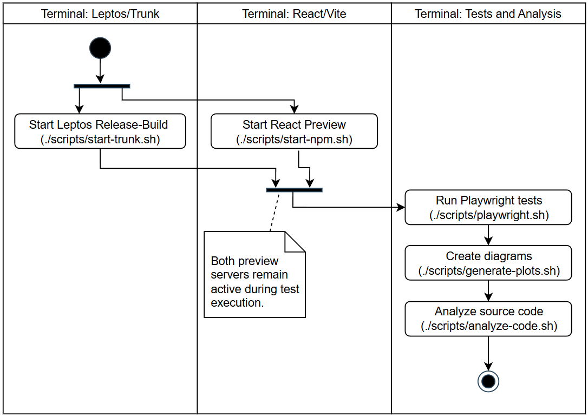

# Vergleich einer Kanban-Anwendung mit React und Leptos

Dieses Repository enthält zwei funktional vergleichbare Kanban-Anwendungen:

- `react-kanban`: Implementierung mit React und TypeScript
- `leptos-kanban`: Implementierung mit Leptos und Rust/WASM

Zusätzlich enthält das Projekt automatisierte Playwright-Messungen sowie
Python-Skripte zur statistischen Auswertung und Visualisierung der Ergebnisse.

## Voraussetzungen

Für die Ausführung werden folgende Programme benötigt:

- Bash
- Node.js und npm
- Rust und Cargo
- Python 3 mit dem Modul `venv`
- `curl` zur Installation von Qlty

Die projektspezifischen Versionen von Tokei, Qlty und Trunk sind in
`scripts/tool-versions.sh` festgelegt. Die Skripte installieren diese Werkzeuge
automatisch und projektlokal unter `.tools/bin`. Node-Abhängigkeiten werden über
die vorhandenen `package-lock.json`-Dateien installiert.

Alle folgenden Befehle werden im Wurzelverzeichnis dieses Repositorys
ausgeführt.

## Anwendungen starten

Für React und Leptos werden zwei getrennte Terminals benötigt.

### 1. React starten

Im ersten Terminal:

```bash
./scripts/start-npm.sh
```

Das Skript installiert die festgeschriebenen npm-Abhängigkeiten, erstellt einen
Produktions-Build und startet die Anwendung unter:

```text
http://localhost:4173
```

### 2. Leptos starten

Im zweiten Terminal:

```bash
./scripts/start-trunk.sh
```

Das Skript installiert die festgelegte Trunk-Version, erstellt einen
Release-Build und startet die Anwendung unter:

```text
http://localhost:8080
```

Beim ersten Start können Installation und Kompilierung einige Minuten dauern.
Beide Server bleiben aktiv, bis sie im jeweiligen Terminal mit `Ctrl+C` beendet
werden.

## Performance-Messungen ausführen

Beide Anwendungen müssen bereits laufen. Anschließend wird in einem dritten
Terminal ausgeführt:

```bash
./scripts/playwright.sh
```

Das Skript installiert die im Lockfile festgelegte Playwright-Version und die
dazugehörigen Browser. Danach werden die Tests mit Chromium, Firefox und WebKit
ausgeführt. Die Rohdaten werden in folgenden Verzeichnissen gespeichert:

- `statistics-kanban/data`: Performance-Messwerte
- `statistics-kanban/dom-mutations-data`: DOM-Mutationsmessungen
- `statistics-kanban/bundle-size-data`: gemessene Bundle-Größen

Falls auf einem Linux-System Browserbibliotheken fehlen, können sie einmalig mit
Systemrechten installiert werden:

```bash
cd playwright-kanban
npx --no-install playwright install --with-deps
cd ..
```

## Diagramme und Tabellen erzeugen

Nach Abschluss der Playwright-Messungen:

```bash
./scripts/generate-plots.sh
```

Das Skript erstellt eine virtuelle Python-Umgebung unter
`statistics-kanban/.venv`, installiert die exakt festgelegten Abhängigkeiten aus
`statistics-kanban/requirements.txt` und erzeugt die Auswertungen unter:

- `results/performance`
- `results/reactivity`
- `results/implementation`

## Implementierungsmetriken erzeugen

Die statischen Implementierungsmetriken werden separat erzeugt:

```bash
./scripts/analyze-code.sh
```

Hierfür werden Tokei `14.0.0` und Qlty `0.640.0` projektlokal installiert. Die
resultierenden Berichte befinden sich anschließend unter
`results/implementation`.

## Kompletter Ablauf



```text
Terminal 1: ./scripts/start-npm.sh
Terminal 2: ./scripts/start-trunk.sh
Terminal 3: ./scripts/playwright.sh
            ./scripts/generate-plots.sh
            ./scripts/analyze-code.sh
```

Die beiden Server müssen während der Playwright-Messungen durchgehend aktiv
bleiben. Danach können sie jeweils mit `Ctrl+C` beendet werden.

## Projektstruktur

```text
leptos-kanban/       Leptos-/Rust-Implementierung
leptos-book/         verwendete Leptos Documentation
react-kanban/        React-/TypeScript-Implementierung
playwright-kanban/   automatisierte Browser- und Performance-Tests
statistics-kanban/   statistische Auswertung der Messdaten
shared/              gemeinsam verwendete Assets und Funktionen
scripts/             Start-, Mess- und Auswertungsskripte
results/             neu erzeugte Auswertungen
results-for-thesis/  für die Bachelorarbeit verwendete Ergebnisse
```
